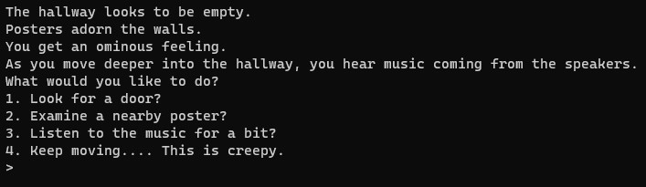

Pokemon Python Version is a "text-based" rpg set in the Pokemon universe. The project contributors, along with myself are:
 Rodrigo Ruiz: https://github.com/Rodrigo-Ruiz1
 Miguel Folgar: https://github.com/MiguelFolgar
 Joshua Simon: https://github.com/joshsimon-bit

 

 Pokemon Python was built using Object-Oriented Programming (OOP) to build classes for each of the pokemon, adversaries (gym trainers), and the pokemon battle dynamics.

 

 My focus, on this project was to build the narrative, character dialog, and general flow of gameplay.

 

 

 Due to the time-constraints, we were limited to the scope of gameplay. However, my main goal was to provide the player with a seamless experience that included revisiting options without simply repeating the dialog.

 

 

 In the end, I think we were able to inject some of our humor and interests into the project and provide a fun experience for the user.

 